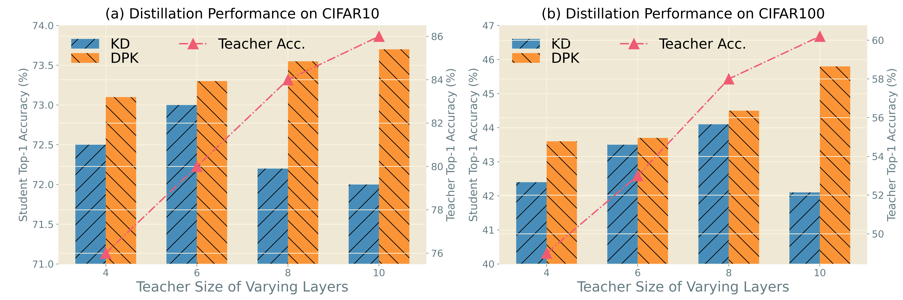
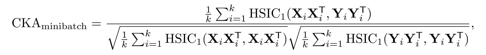
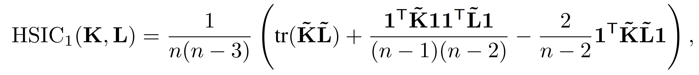
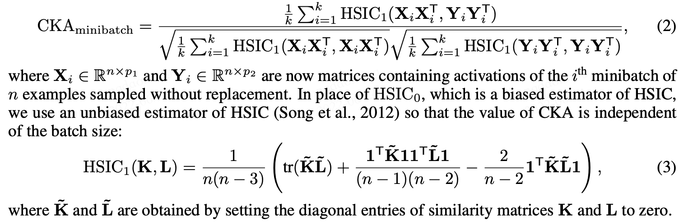
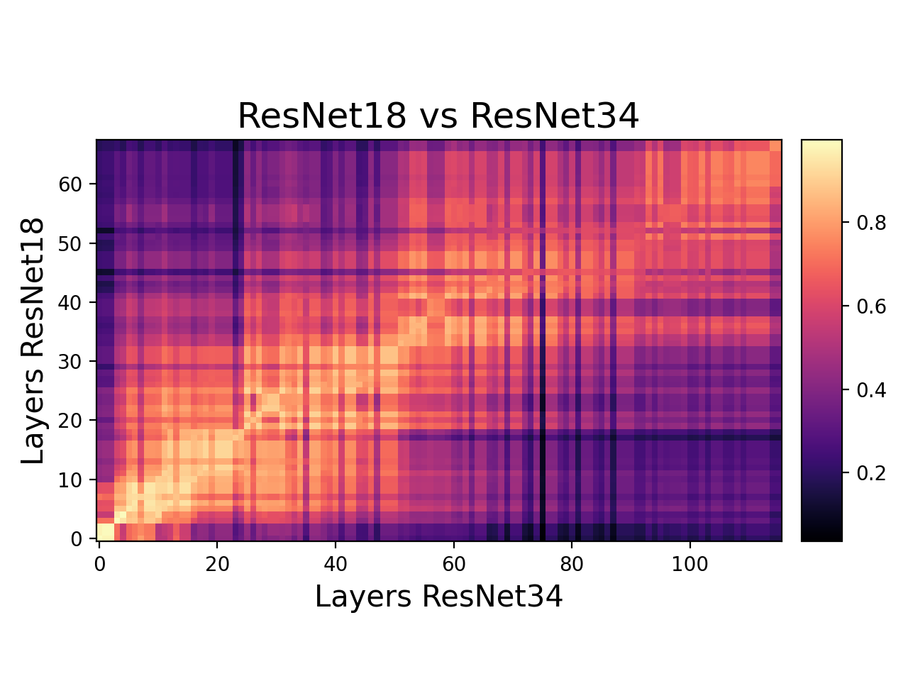
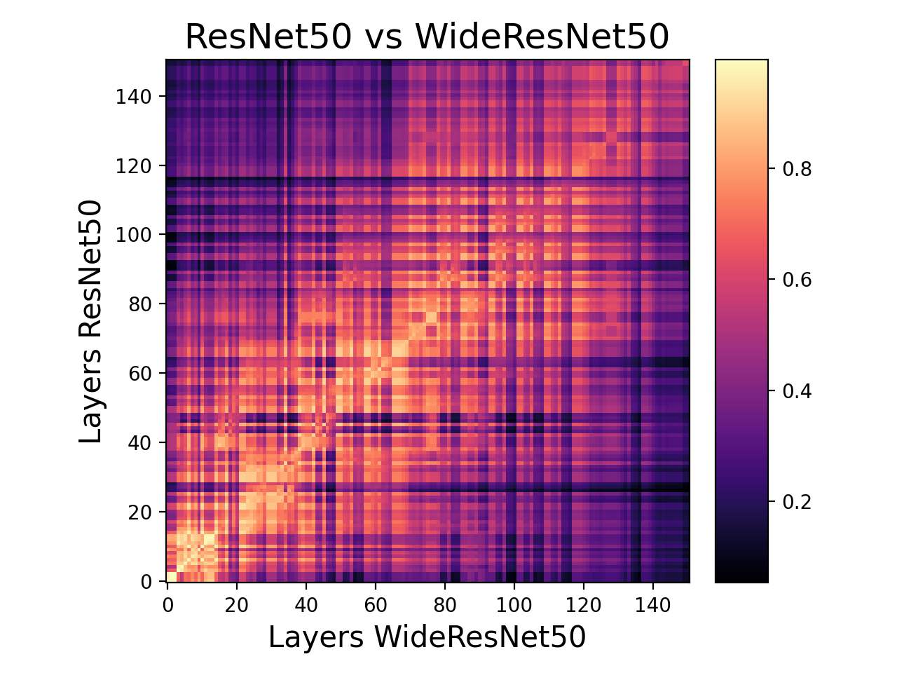
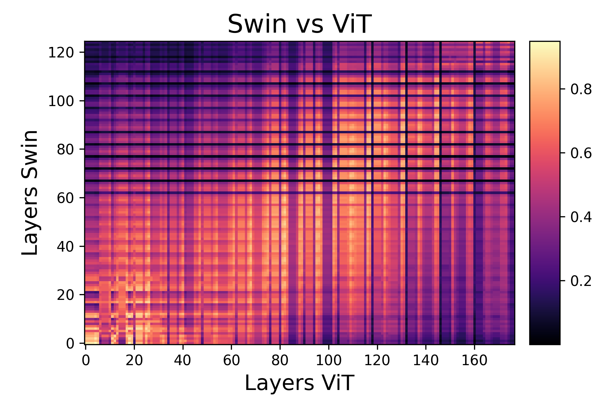
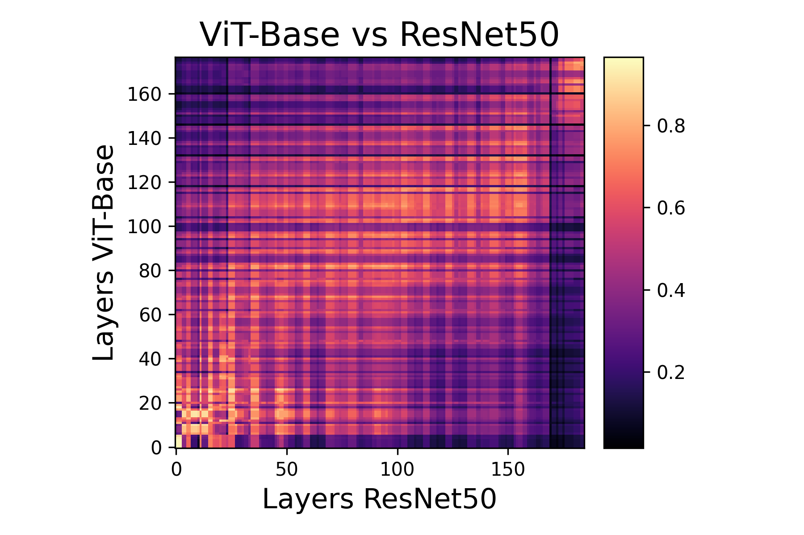
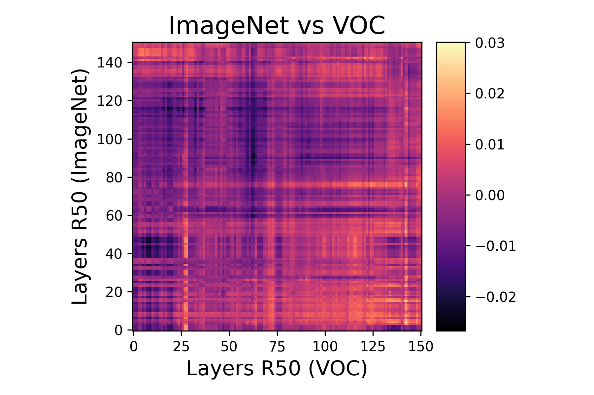

# Rebuttal for Better Teacher Better Student: Dynamic Prior Knowledge for Knowledge Distillation.
This is a temporary, anonymous repository for additional explanations of the questions/comments raised by ICLR 2023 reviewers.


## 1. Capacity-Performance Gap Issue

Although, we have witnessed performance gains of DPK on the existing knowledge distillation framework, further analysis of the claim better teacher makes better student is desired. To this end, we train a plain CNN with batch normalization, skip connection and ReLU activation as the student. It is distilled by large teachers of 4, 6, 8, and 10 layers on both CIFAR10 and CIFAR100. As expected, by increasing the student number of layers, the student performance gain is initially increased and then decreased due to the capacity mismatch by conventional KD, as illustrated in the above Figure. On the other hand, with DPK, the student performance gain is positively correlated to the student size. This suggests that our model does make a bigger model a better teacher.


## 2. About Centered Kernel Alignment
Centered Kernel Alignment (CKA) is a representation similarity metric that is widely used for understanding the representations learned by neural networks. Specifically, CKA takes two feature maps / representations ***X*** and ***Y*** as input and computes their normalized similarity (in terms of the Hilbert-Schmidt Independence Criterion (HSIC)) as


Where ***K*** and ***L*** are similarity matrices of ***X*** and ***Y*** respectively.

However, naive computation of linear CKA requires maintaining the activations across the entire dataset in memory, which is challenging for wide and deep networks. To reduce memory consumption, a minibatch version of CKA was proposed to compute linear CKA by averaging HSIC scores over <span style="color:blue">$k$</span> minibatches:

<!-- However, the above formula is not scalable against deep architectures and large datasets. Therefore, a minibatch version can be constructed that uses an unbiased estimator of the HSIC as -->

<!--  -->
<!--  -->



`More details can be found in the 2021 ICLR paper` published by [Nguyen T., Raghu M, Kornblith S](https://arxiv.org/abs/2010.15327).

## Getting Started

<!-- ### Installation
```
pip install torch_cka
``` -->

### Code for Generating Figure 1 in the Main Text
```python
import torch
from torch_cka import CKA

def plot_results(hsic_matrix,
                    model_1_name: str=None,
                    model_2_name: str=None,
                    save_path: str = None,
                    title: str = None):
    fig, ax = plt.subplots(nrows=1,ncols=1)
    hsic_matrix = np.sort(hsic_matrix) # sort
    im = ax.imshow(hsic_matrix.reshape(int(np.sqrt(hsic_matrix.shape[0])),int(np.sqrt(hsic_matrix.shape[0]))), origin='lower', cmap='Spectral_r')        
    ax.set_xlabel(f"Sample Index", fontsize=15)
    ax.set_ylabel(f"Sample Index", fontsize=15)     
    if title is not None:
        ax.set_title(f"{title}", fontsize=15)
    else:
        ax.set_title(f"CKA scores of {model_1_name} vs. {model_2_name}", fontsize=15)
    add_colorbar(im)
    plt.tight_layout()
    if save_path is not None:
        plt.savefig(save_path, bbox_inches='tight', pad_inches=0, dpi=500)
    plt.show()   

def cka_plot(teacher, student, data_loader,**kwargs):
    cka = CKA(student, teacher,
            model1_name="ResNet18", model2_name="ResNet50",
            # model1_layers=layer_names_resnet18, # List of layers to extract features from
            # model2_layers=layer_names_resnet34, # extracts all layer features by default            
            device='cuda')
    cka.compare_minibatches(data_loader)
    results = cka.export()
    print("Results have returned !!! ")
    with open('./test.pkl', 'wb') as handle:
        pickle.dump(results, handle, protocol=pickle.HIGHEST_PROTOCOL)
    plot_results(results['CKA'], "ResNet18 (ICKD)", "ResNet50", save_path="test.png"  
```

. And the x and y axes indexing the minibatches. A total of 400 mini-batches of data are displayed.")

. And the x and y axes indexing the minibatches. A total of 400 mini-batches of data are displayed.")

## Other Heatmaps 

`torch_cka` can be used with any pytorch model (subclass of `nn.Module`) and can be used with pretrained models available from popular sources like torchHub, timm, huggingface etc. Some examples of where this package can come in handy are illustrated below.

### Usage
```python
from torch_cka import CKA
model1 = resnet18(pretrained=True)  # Or any neural network of your choice
model2 = resnet34(pretrained=True)

dataloader = DataLoader(your_dataset, 
                        batch_size=batch_size, # according to your device memory
                        shuffle=False)  # Don't forget to seed your dataloader

cka = CKA(model1, model2,
          model1_name="ResNet18",   # good idea to provide names to avoid confusion
          model2_name="ResNet34",   
          model1_layers=layer_names_resnet18, # List of layers to extract features from
          model2_layers=layer_names_resnet34, # extracts all layer features by default
          device='cuda')

cka.compare(dataloader) # secondary dataloader is optional

results = cka.export()  # returns a dict that contains model names, layer names
                        # and the CKA matrix
cka.plot_results(save_path="diagonal_compare_test.png")
```


### Comparing the effect of Depth
A simple experiment is to analyse the features learned by two architectures of the same family - ResNets but of different depths. Taking two ResNets - ResNet18 and ResNet34 - pre-trained on the Imagenet dataset, we can analyse how they produce their features on, say CIFAR10 for simplicity. This comparison is shown as a heatmap below. 



We see high degree of similarity between the two models in lower layers as they both learn similar representations from the data. However at higher layers, the similarity reduces as the deeper model (ResNet34) learn higher order features which the is elusive to the shallower model (ResNet18). Yet, they do indeed have certain similarity in their last fc layer which acts as the feature classifier.

### Comparing Two Similar Architectures
Another way of using CKA is in ablation studies. We can go further than those ablation studies that only focus on resultant performance and employ CKA to study the internal representations. Case in point - ResNet50 and WideResNet50 (k=2). WideResNet50 has the same architecture as ResNet50 except having wider residual bottleneck layers (by a factor of 2 in this case).



We clearly notice that the learned features are indeed different after the first few layers. The width has a more pronounced effect in deeper layers as compared to the earlier layers as both networks seem to learn similar features in the initial layers. 

As a bonus, here is a comparison between ViT and the latest SOTA model [Swin Transformer](https://arxiv.org/abs/2103.14030) pretrained on ImageNet22k.




### Comparing quite different architectures
CNNs have been analysed a lot over the past decade since AlexNet. We somewhat know what sort of features they learn across their layers (through visualizations) and we have put them to good use. One interesting approach is to compare these understandable features with newer models that don't permit easy visualizations (like recent vision transformer architectures) and study them. This has indeed been a hot research topic (see [Raghu et.al 2021](https://arxiv.org/abs/2108.08810)).



### Comparing Datasets 
Yet another application is to compare two datasets - preferably two versions of the data. This is especially useful in production where data drift is a known issue. If you have an updated version of a dataset, you can study how your model will perform on it by comparing the representations of the datasets. This can be more telling about actual performance than simply comparing the datasets directly. 

This can also be quite useful in studying the performance of a model on downstream tasks and fine-tuning. For instance, if the CKA score is high for some features on different datasets, then those can be frozen during fine-tuning. As an example, the following figure compares the features of a pretrained Resnet50 on the Imagenet test data and the VOC dataset. Clearly, the pretrained features have little correlation with the VOC dataset. Therefore, we have to resort to fine-tuning to get at least satisfactory results.


