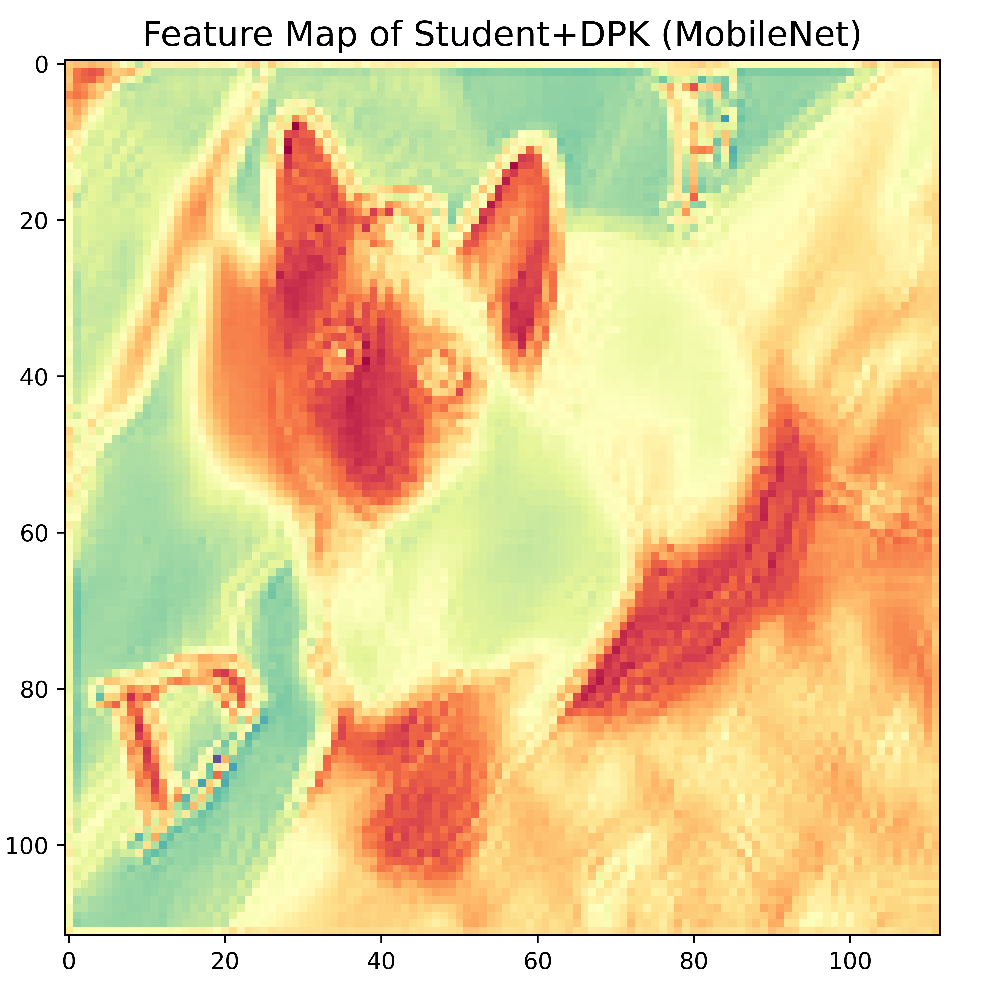

### Visulization of feature maps, Grad-CAM, and Guided Grad-CAM for teachers, students, and distilled students

### Results of a heterogeneous teacher-student distillation pair (ResNet101(T)-MobileNetV1(S)) on ImageNet.

	
	&emsp;&emsp;&emsp;&emsp;&emsp;&emsp;&emsp;&emsp;
	
    &emsp;&emsp;&emsp;&emsp;&emsp;&emsp;&emsp;&emsp;
    
	 
	Original input image
	&emsp;&emsp;&emsp;&emsp;&emsp;&emsp;&emsp;&emsp;
	&emsp;&emsp;&emsp;&emsp;&emsp;&emsp;&emsp;&emsp;
	&emsp;&emsp;&emsp;&emsp;
    Feature map of Student (MobileNet)
    &emsp;&emsp;&emsp;&emsp;&emsp;&emsp;&emsp;&emsp;
	&emsp;&emsp;&emsp;&emsp;
    Heatmaps of Student (MobileNet)

 

	
	&emsp;&emsp;&emsp;&emsp;&emsp;&emsp;&emsp;&emsp;
	
    &emsp;&emsp;&emsp;&emsp;&emsp;&emsp;&emsp;&emsp;
    
	 
	Original input image
	&emsp;&emsp;&emsp;&emsp;&emsp;&emsp;&emsp;&emsp;
	&emsp;&emsp;&emsp;&emsp;&emsp;
    Feature map of ICKD-Distilled Student (MobileNet)
    &emsp;
    Heatmaps of ICKD-Distilled Student (MobileNet)

 

	
	&emsp;&emsp;&emsp;&emsp;&emsp;&emsp;&emsp;&emsp;
	
    &emsp;&emsp;&emsp;&emsp;&emsp;&emsp;&emsp;&emsp;
    
	 
	Original input image
	&emsp;&emsp;&emsp;&emsp;&emsp;&emsp;&emsp;&emsp;
	&emsp;&emsp;&emsp;&emsp;
    Feature map of DPK-Distilled Student (MobileNet)
    &emsp;
    Heatmaps of DPK-Distilled Student (MobileNet)

 

	
	&emsp;&emsp;&emsp;&emsp;&emsp;&emsp;&emsp;&emsp;
	
    &emsp;&emsp;&emsp;&emsp;&emsp;&emsp;&emsp;&emsp;
    
	 
	Original input image
	&emsp;&emsp;&emsp;&emsp;&emsp;&emsp;&emsp;&emsp;
	&emsp;&emsp;&emsp;&emsp;&emsp;&emsp;&emsp;&emsp;
	&emsp;&emsp;&emsp;&emsp;
    Feature map of Teacher (ResNet101)
    &emsp;&emsp;&emsp;&emsp;&emsp;&emsp;&emsp;&emsp;
	&emsp;&emsp;&emsp;&emsp;
    Heatmaps of Teacher (ResNet101)

 

<!--######################################################################################################################################################-->

	
	&emsp;&emsp;&emsp;&emsp;&emsp;&emsp;&emsp;&emsp;
	
    &emsp;&emsp;&emsp;&emsp;&emsp;&emsp;&emsp;&emsp;
    
	 
	Original input image
	&emsp;&emsp;&emsp;&emsp;&emsp;&emsp;&emsp;&emsp;
	&emsp;&emsp;&emsp;&emsp;
    Feature map of Student (MobileNet)
    &emsp;
    Heatmaps of Student (MobileNet)

 

	
	&emsp;&emsp;&emsp;&emsp;&emsp;&emsp;&emsp;&emsp;
	
    &emsp;&emsp;&emsp;&emsp;&emsp;&emsp;&emsp;&emsp;
    
	 
	Original input image
	&emsp;&emsp;&emsp;&emsp;&emsp;&emsp;&emsp;&emsp;
	&emsp;&emsp;&emsp;&emsp;
    Feature map of ICKD-Distilled Student (MobileNet)
    &emsp;
    Heatmaps of ICKD-Distilled Student (MobileNet)

 

	
	&emsp;&emsp;&emsp;&emsp;&emsp;&emsp;&emsp;&emsp;
	
    &emsp;&emsp;&emsp;&emsp;&emsp;&emsp;&emsp;&emsp;
    
	 
	Original input image
	&emsp;&emsp;&emsp;&emsp;&emsp;&emsp;&emsp;&emsp;
	&emsp;&emsp;&emsp;&emsp;
    Feature map of DPK-Distilled Student (MobileNet)
    &emsp;
    Heatmaps of DPK-Distilled Student (MobileNet)

 

	
	&emsp;&emsp;&emsp;&emsp;&emsp;&emsp;&emsp;&emsp;
	
    &emsp;&emsp;&emsp;&emsp;&emsp;&emsp;&emsp;&emsp;
    
	 
	Original input image
	&emsp;&emsp;&emsp;&emsp;&emsp;&emsp;&emsp;&emsp;
	&emsp;&emsp;&emsp;&emsp;
    Feature map of Teacher (ResNet101)
    &emsp;
    Heatmaps of Teacher (ResNet101)

 

<!--######################################################################################################################################################-->

### Results of a homogeneous teacher-student distillation pair (ResNet101(T)-ResNet50(S)) on ImageNet.

	
	&emsp;&emsp;&emsp;&emsp;&emsp;&emsp;&emsp;&emsp;
	
    &emsp;&emsp;&emsp;&emsp;&emsp;&emsp;&emsp;&emsp;
    
	 
	Original input image
	&emsp;&emsp;&emsp;&emsp;&emsp;&emsp;&emsp;&emsp;
	&emsp;&emsp;&emsp;&emsp;
    Feature map of Student (MobileNet)
    &emsp;
    Heatmaps of Student (MobileNet)

 

	
	&emsp;&emsp;&emsp;&emsp;&emsp;&emsp;&emsp;&emsp;
	
    &emsp;&emsp;&emsp;&emsp;&emsp;&emsp;&emsp;&emsp;
    
	 
	Original input image
	&emsp;&emsp;&emsp;&emsp;&emsp;&emsp;&emsp;&emsp;
	&emsp;&emsp;&emsp;
    Feature map of ICKD-Distilled Student (MobileNet)
    &emsp;&emsp;&emsp;
    Heatmaps of ICKD-Distilled Student (MobileNet)

 

	
	&emsp;&emsp;&emsp;&emsp;&emsp;&emsp;&emsp;&emsp;
	
    &emsp;&emsp;&emsp;&emsp;&emsp;&emsp;&emsp;&emsp;
    
	 
	Original input image
	&emsp;&emsp;&emsp;&emsp;&emsp;&emsp;&emsp;&emsp;
	&emsp;&emsp;&emsp;
    Feature map of DPK-Distilled Student (MobileNet)
    &emsp;&emsp;&emsp;
    Heatmaps of DPK-Distilled Student (MobileNet)

 

	
	&emsp;&emsp;&emsp;&emsp;&emsp;&emsp;&emsp;&emsp;
	
    &emsp;&emsp;&emsp;&emsp;&emsp;&emsp;&emsp;&emsp;
    
	 
	Original input image
	&emsp;&emsp;&emsp;&emsp;&emsp;&emsp;&emsp;&emsp;
	&emsp;&emsp;&emsp;
    Feature map of Teacher (ResNet101)
    &emsp;
    Heatmaps of Teacher (ResNet101)

 

<!--######################################################################################################################################################-->

	
	&emsp;&emsp;&emsp;&emsp;&emsp;&emsp;&emsp;&emsp;
	
    &emsp;&emsp;&emsp;&emsp;&emsp;&emsp;&emsp;&emsp;
    
	 
	Original input image
	&emsp;&emsp;&emsp;&emsp;&emsp;&emsp;&emsp;&emsp;
	&emsp;&emsp;&emsp;
    Feature map of Student (MobileNet)
    &emsp;
    Heatmaps of Student (MobileNet)

 

	
	&emsp;&emsp;&emsp;&emsp;&emsp;&emsp;&emsp;&emsp;
	
    &emsp;&emsp;&emsp;&emsp;&emsp;&emsp;&emsp;&emsp;
    
	 
	Original input image
	&emsp;&emsp;&emsp;&emsp;&emsp;&emsp;&emsp;&emsp;
	&emsp;&emsp;&emsp;&emsp;&emsp;&emsp;&emsp;&emsp;
	&emsp;
    Feature map of ICKD-Distilled Student (ResNet50)
    &emsp;&emsp;&emsp;
    Heatmaps of ICKD-Distilled Student (ResNet50)

 

	
	&emsp;&emsp;&emsp;&emsp;&emsp;&emsp;&emsp;&emsp;
	
    &emsp;&emsp;&emsp;&emsp;&emsp;&emsp;&emsp;&emsp;
    
	 
	Original input image
	&emsp;&emsp;&emsp;&emsp;&emsp;&emsp;&emsp;&emsp;
	&emsp;&emsp;&emsp;&emsp;&emsp;&emsp;&emsp;&emsp;
	&emsp;
    Feature map of DPK-Distilled Student (ResNet50)
    &emsp;&emsp;&emsp;
    Heatmaps of DPK-Distilled Student (ResNet50)

 

	
	&emsp;&emsp;&emsp;&emsp;&emsp;&emsp;&emsp;&emsp;
	
    &emsp;&emsp;&emsp;&emsp;&emsp;&emsp;&emsp;&emsp;
    
	 
	Original input image
	&emsp;&emsp;&emsp;&emsp;&emsp;&emsp;&emsp;&emsp;
	&emsp;&emsp;&emsp;&emsp;&emsp;&emsp;&emsp;&emsp;
	&emsp;&emsp;&emsp;&emsp;
    Feature map of Teacher (ResNet101)
    &emsp;&emsp;&emsp;&emsp;&emsp;&emsp;&emsp;&emsp;
	&emsp;&emsp;&emsp;&emsp;
    Heatmaps of Teacher (ResNet101)

 

<!--######################################################################################################################################################-->

### ResNet152-FPN is used as the teacher and ResNet50-FPN is used as the student. We demonstrate some additional visualisations and figures for object detection distillation on MS-COCO.

	
	&emsp;&emsp;&emsp;&emsp;&emsp;&emsp;&emsp;&emsp;
	
    &emsp;&emsp;&emsp;&emsp;&emsp;&emsp;&emsp;&emsp;
    
	 
	Original input image
	&emsp;&emsp;&emsp;&emsp;&emsp;&emsp;&emsp;&emsp;
	&emsp;&emsp;&emsp;&emsp;&emsp;&emsp;&emsp;&emsp;
	&emsp;&emsp;&emsp;&emsp;
    Feature map of Student (ResNet50-FPN)
    &emsp;&emsp;&emsp;&emsp;&emsp;&emsp;&emsp;&emsp;
	&emsp;
    Heatmaps of Student (ResNet50-FPN)

 

	
	&emsp;&emsp;&emsp;&emsp;&emsp;&emsp;&emsp;&emsp;
	
    &emsp;&emsp;&emsp;&emsp;&emsp;&emsp;&emsp;&emsp;
    
	 
	Original input image
	&emsp;&emsp;&emsp;&emsp;&emsp;&emsp;&emsp;&emsp;
	&emsp;&emsp;&emsp;&emsp;&emsp;&emsp;&emsp;&emsp;
    Feature Map of FGD-Distilled Student (ResNet50-FPN)
    &emsp;&emsp;&emsp;
    Heatmaps of FGD-Distilled Student (ResNet50-PFN)

 

	
	&emsp;&emsp;&emsp;&emsp;&emsp;&emsp;&emsp;&emsp;
	
    &emsp;&emsp;&emsp;&emsp;&emsp;&emsp;&emsp;&emsp;
    
	 
	Original input image
	&emsp;&emsp;&emsp;&emsp;&emsp;&emsp;&emsp;&emsp;
	&emsp;&emsp;&emsp;&emsp;&emsp;&emsp;&emsp;&emsp;
    Feature Map of DPK-Distilled Student (ResNet50-FPN)
    &emsp;&emsp;&emsp;
    Heatmaps of DPK-Distilled Student (ResNet50-FPN)

 

	
	&emsp;&emsp;&emsp;&emsp;&emsp;&emsp;&emsp;&emsp;
	
    &emsp;&emsp;&emsp;&emsp;&emsp;&emsp;&emsp;&emsp;
    
	 
	Original input image
	&emsp;&emsp;&emsp;&emsp;&emsp;&emsp;&emsp;&emsp;
	&emsp;&emsp;&emsp;&emsp;&emsp;&emsp;&emsp;&emsp;
    Feature Map of Teacher (ResNet152-FPN)
    &emsp;&emsp;&emsp;&emsp;&emsp;&emsp;&emsp;&emsp;
	&emsp;&emsp;&emsp;&emsp;
    Heatmaps of Teacher (ResNet152-FPN)

 

<!--######################################################################################################################################################-->

	
	&emsp;&emsp;&emsp;&emsp;&emsp;&emsp;&emsp;&emsp;
	
    &emsp;&emsp;&emsp;&emsp;&emsp;&emsp;&emsp;&emsp;
    
	 
	Original input image
	&emsp;&emsp;&emsp;&emsp;&emsp;&emsp;&emsp;&emsp;
	&emsp;&emsp;&emsp;&emsp;&emsp;&emsp;&emsp;&emsp;
	&emsp;&emsp;&emsp;&emsp;
    Feature map of Student (ResNet50-FPN)
    &emsp;&emsp;&emsp;&emsp;&emsp;&emsp;&emsp;&emsp;
	&emsp;
    Heatmaps of Student (ResNet50-FPN)

 

	
	&emsp;&emsp;&emsp;&emsp;&emsp;&emsp;&emsp;&emsp;
	
    &emsp;&emsp;&emsp;&emsp;&emsp;&emsp;&emsp;&emsp;
    
	 
	Original input image
	&emsp;&emsp;&emsp;&emsp;&emsp;&emsp;&emsp;&emsp;
	&emsp;&emsp;&emsp;&emsp;&emsp;&emsp;&emsp;&emsp;
    Feature Map of FGD-Distilled Student (ResNet50-FPN)
    &emsp;&emsp;&emsp;
    Heatmaps of FGD-Distilled Student (ResNet50-PFN)

 

	
	&emsp;&emsp;&emsp;&emsp;&emsp;&emsp;&emsp;&emsp;
	
    &emsp;&emsp;&emsp;&emsp;&emsp;&emsp;&emsp;&emsp;
    
	 
	Original input image
	&emsp;&emsp;&emsp;&emsp;&emsp;&emsp;&emsp;&emsp;
	&emsp;&emsp;&emsp;&emsp;&emsp;&emsp;&emsp;&emsp;
    Feature Map of DPK-Distilled Student (ResNet50-FPN)
    &emsp;&emsp;&emsp;
    Heatmaps of DPK-Distilled Student (ResNet50-FPN)

 

	
	&emsp;&emsp;&emsp;&emsp;&emsp;&emsp;&emsp;&emsp;
	
    &emsp;&emsp;&emsp;&emsp;&emsp;&emsp;&emsp;&emsp;
    
	 
	Original input image
	&emsp;&emsp;&emsp;&emsp;&emsp;&emsp;&emsp;&emsp;
	&emsp;&emsp;&emsp;&emsp;&emsp;&emsp;&emsp;&emsp;
    Feature Map of Teacher (ResNet152-FPN)
    &emsp;&emsp;&emsp;&emsp;&emsp;&emsp;&emsp;&emsp;
	&emsp;&emsp;&emsp;&emsp;
    Heatmaps of Teacher (ResNet152-FPN)

 
