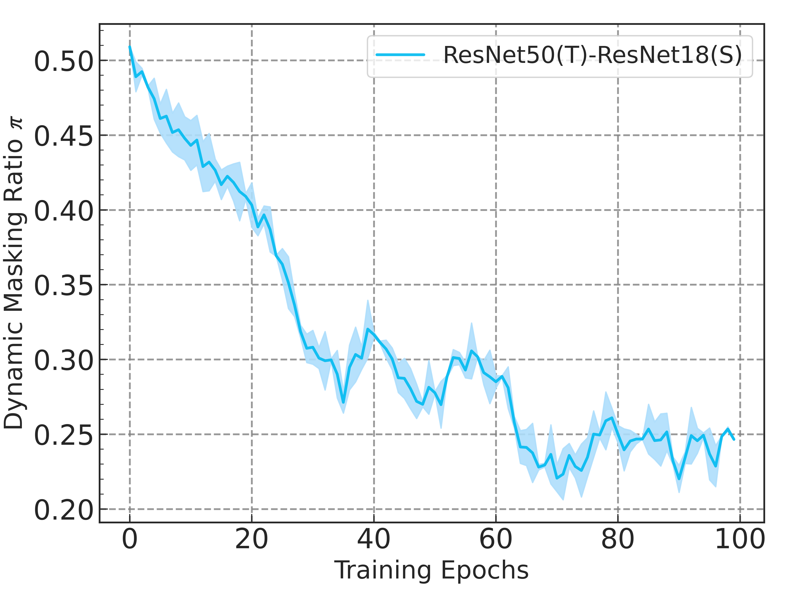
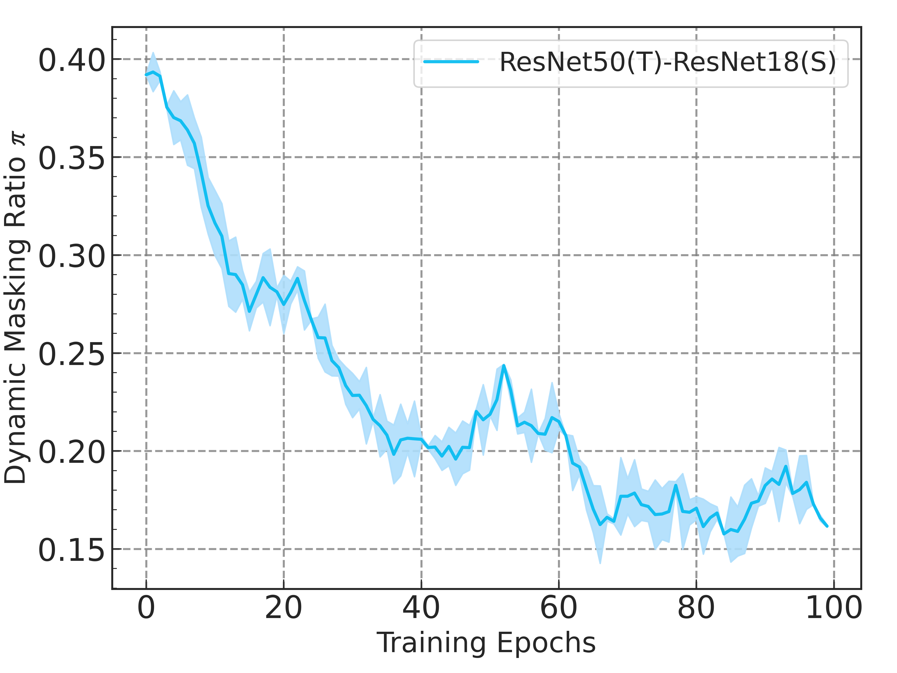
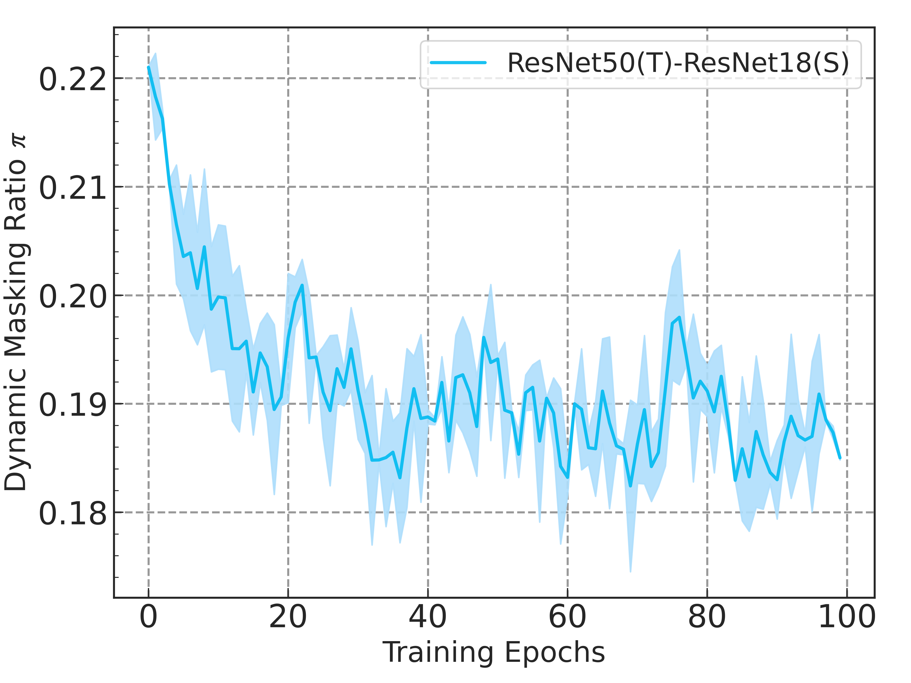
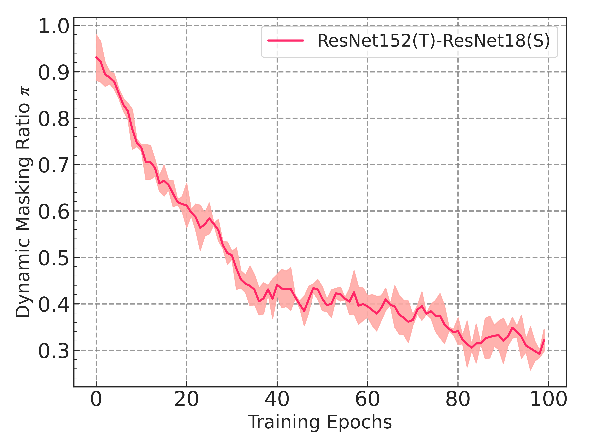
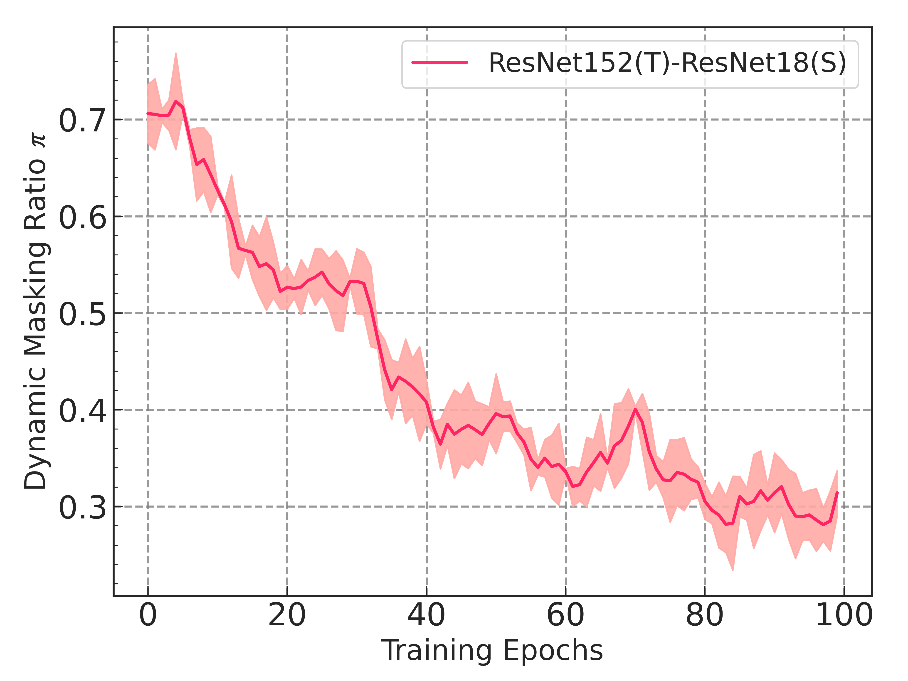
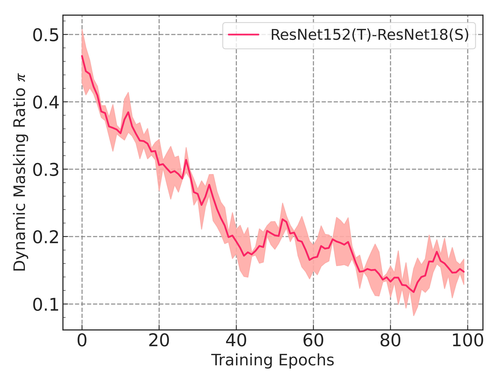

### Dynamic masking ratios of different stages in the training phase. 
We visualize the dynamic mask ratios at different stages on ImageNet. The mask ratios are adjusted in batch-level, and are averaged in epoch-level for better presentation.

	
	&emsp;
	
    &emsp;
    
	 
	Stage 2
	&emsp;&emsp;&emsp;&emsp;&emsp;&emsp;&emsp;&emsp;&emsp;&emsp;&emsp;&emsp;&emsp;
    &emsp;&emsp;&emsp;
    Stage 3
    &emsp;&emsp;&emsp;&emsp;&emsp;&emsp;&emsp;&emsp;&emsp;&emsp;&emsp;&emsp;&emsp;
    &emsp;&emsp;&emsp;
    Stage 4

 

	
	&emsp;
	
    &emsp;
    
	 
	Stage 2
	&emsp;&emsp;&emsp;&emsp;&emsp;&emsp;&emsp;&emsp;&emsp;&emsp;&emsp;&emsp;&emsp;
    &emsp;&emsp;&emsp;
    Stage 3
    &emsp;&emsp;&emsp;&emsp;&emsp;&emsp;&emsp;&emsp;&emsp;&emsp;&emsp;&emsp;&emsp;
    &emsp;&emsp;&emsp;
    Stage 4

 

